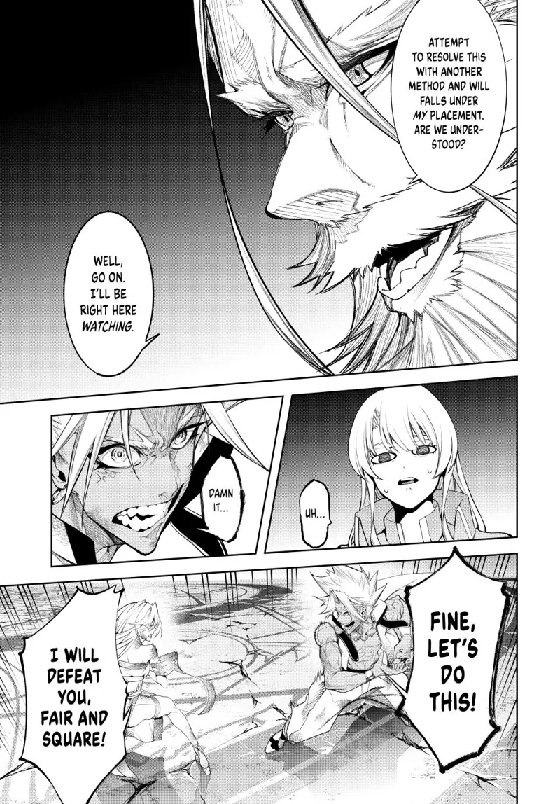

# MangaTranslator
## Giới thiệu
Dịch manga từ tiếng Anh sang tiếng Việt (hoặc ngôn ngữ khác nếu sửa một vài câu lệnh)
## Luồng hoạt động
1. **Đầu vào**: Các đường dẫn ảnh manga gốc là tiếng Anh (định dạng PNG, JPG, JPEG).
2. **Phát hiện và trích xuất văn bản**: Sử dụng PaddleOCR để detect các chữ
3. **Phân cụm các chữ**: Vì các kí tự có thể sắp xếp chưa chính xác, nên dùng thuật toán phân cụm để tính toán các bboxes lớn chứa từng hội thoại của nhân vật
5. **Dịch văn bản**: Dịch văn bản đã trích xuất sang tiếng Việt dùng GoogleTranslate API từ thư viện deep_translation (có thể sử dụng các API khác như chatgpt để tăng độ chính xác)
6. **Xoá nền và tính toán font-size**: Tính toán để tìm font-size sao cho phù hợp để vừa với bbox
7. **Chèn văn bản**: Chèn văn bản đã dịch vào vị trí tương ứng trên ảnh gốc
8. **Đầu ra**: Lưu các trang manga đã được dịch dưới dạng ảnh mới.

## Ví dụ

  
  

